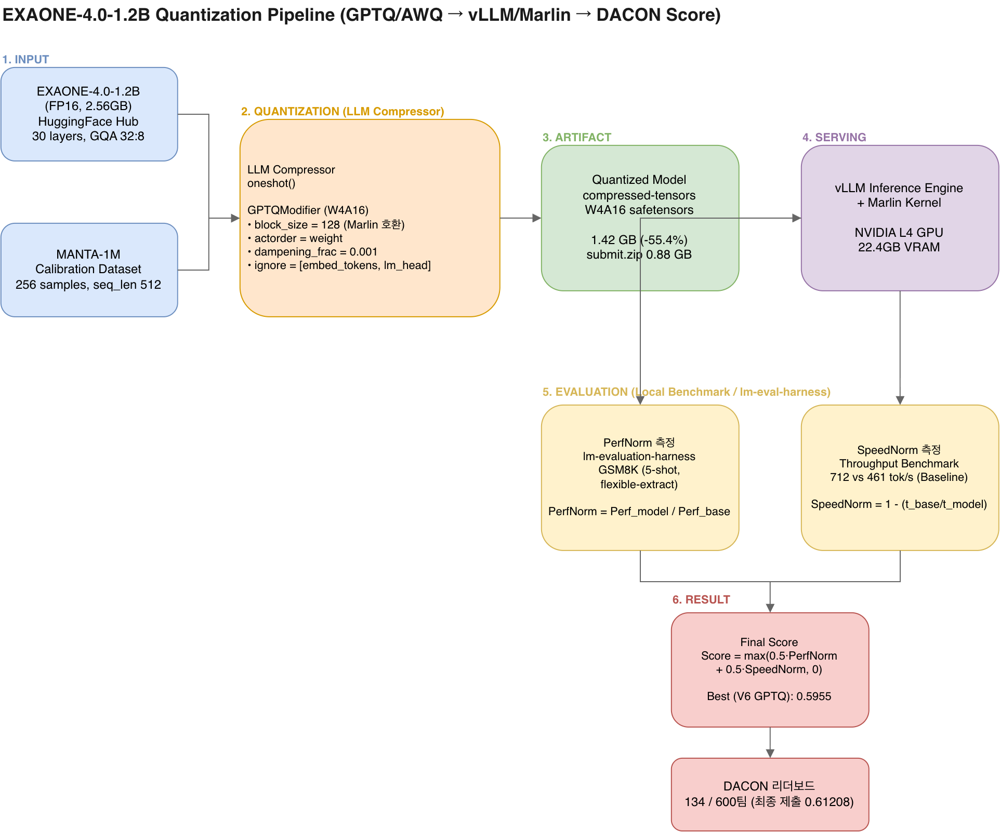
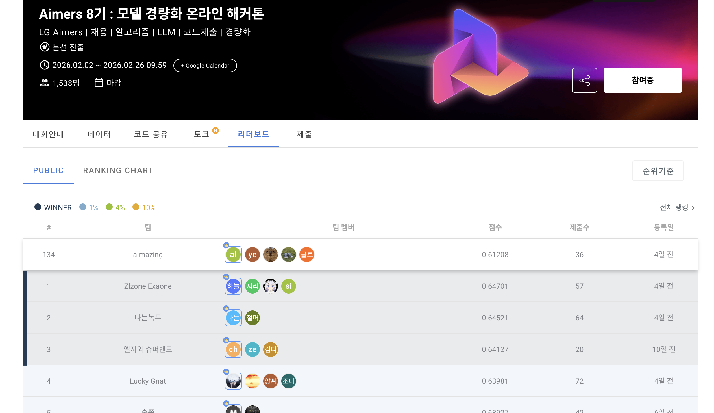

# LG Aimers 8기 - LLM 경량화 해커톤

> EXAONE-4.0-1.2B 모델을 GPTQ/AWQ로 양자화하여 성능은 유지하면서 추론 속도를 극대화하는 해커톤 프로젝트 — 17개 실험으로 압축률 55%, 추론 속도 2.6배(Marlin 커널) 개선


> **600팀 중 134등** | 최종 점수 **0.61208** (1,538명 참가) — 상세 스코어보드는 [Key Results](#key-results) 참고

## Overview

**LG Aimers 8기**에 참가하여, Phase 1(1개월 온라인 교육)과 Phase 2(온라인 해커톤)를 진행했습니다.

온라인 교육 기간 동안 학습한 AI/LLM 기초부터 경량화 기법까지의 내용은 [블로그](https://hpyquokka.tistory.com/category/LG%20Aimers)에 정리했습니다.

Phase 2 해커톤에서는 LG AI연구원의 **EXAONE-4.0-1.2B** 모델을 대상으로, GPTQ/AWQ 양자화 기법을 적용하여 **성능 유지(PerfNorm)와 속도 향상(SpeedNorm)의 최적 균형점**을 찾는 17개의 실험을 수행했습니다.

| 항목 | 내용 |
|------|------|
| 대회명 | Aimers 8기: 모델 경량화 온라인 해커톤 |
| 기간 | 2026.02.02 ~ 2026.02.26 |
| 대상 모델 | EXAONE-4.0-1.2B (1.28B params, 30 layers) |
| 평가 산식 | `Score = 0.5 × PerfNorm + 0.5 × SpeedNorm` |
| 실행 환경 | NVIDIA L4 GPU (22.4GB VRAM), 6 vCPU, 28GB RAM |
| 제약 사항 | 제출 파일 ≤ 10GB, 추론 ≤ 20분, vLLM 수정 불가 |
| 주최 / 주관 | LG AI연구원 / DACON |

왜 "단순 파라미터 축소"가 아니라 양자화인가? 대회 배경 문서(`docs/DACON_대회_공식정보.md`)가 지적하듯, 파라미터 수를 줄이는 프루닝 계열은 크기·속도에는 유리하지만 정확도 저하가 크다는 한계가 있습니다. 반대로 **PTQ(Post-Training Quantization) 계열인 GPTQ/AWQ는 재학습 없이 가중치 정밀도만 낮춰**, "구조는 그대로 두고 표현 비트만 압축"하는 접근이라 이번 대회의 제약(추론 20분 이내, vLLM 수정 불가)에 가장 적합했습니다.

## Demo

이 프로젝트는 대화형 UI가 아닌 **재현 가능한 실험 파이프라인**이므로, 데모는 실제 양자화 실행 로그로 대체합니다. 아래는 최고 점수(0.5955)를 기록한 V6(Optimized GPTQ) 실험의 실제 실행 로그 발췌입니다 (`notebooks/02_optimization/06_optimized_GPTQ.ipynb`, 2026-02-10 로컬 실행 기록에서 그대로 가져옴).

```text
$ jupyter nbconvert --to notebook --execute notebooks/02_optimization/06_optimized_GPTQ.ipynb
```

```text
[INFO] 모델 로드 중...
[INFO] 모델 파라미터: 1,279,391,488
[INFO] 모델/토크나이저 로드 완료

[INFO] GPTQ 양자화 시작 (최적화 버전)
  - scheme: W4A16
  - samples: 256
  - max_len: 512
  - block_size: 128 (Marlin 호환)
  - actorder: weight (정확도 향상)
  - dampening_frac: 0.001

(1/31): Calibrating: 100%|██████████| 256/256 [01:05<00:00, 3.91it/s]
2026-02-10T14:32:29 | compress | METRIC - time 0.46s
2026-02-10T14:32:29 | compress | METRIC - error 1.07
2026-02-10T14:32:29 | compress | METRIC - Compressed module size: 16.941056 MB
...
(31/31): Propagating: 100%|██████████| 256/256 [00:00<00:00, 4240.45it/s]
[INFO] GPTQ 양자화 완료!

============================================================
모델 크기 비교
============================================================
  원본 모델:     2.56 GB
  양자화 모델:   1.42 GB
  압축률:        55.4%
============================================================

[INFO] submit_optimized.zip 생성 중...
[INFO] 생성 완료: submit_optimized.zip (0.88 GB)
✅ 용량 제한 충족 (≤ 10GB)
```

이렇게 생성된 제출 파일이 로컬 벤치마크(`notebooks/benchmark/benchmark_local.ipynb`)에서 **GSM8K 0.5977 / 712 tok/s**로 측정되어 V6 단일 실험 최고점 **0.5955**를 기록했고, 이후 레이어 민감도 분석 등을 반영한 최종 제출은 리더보드 기준 **0.61208 (134/600팀)** 을 달성했습니다.

```python
# 대회 채점 공식을 그대로 재현하는 빠른 점수 계산기 (notebooks/benchmark/benchmark_local.ipynb)
GSM8K_SCORE = 0.5977      # GSM8K exact_match (flexible-extract)
MODEL_TOK_PER_SEC = 712   # 양자화 모델 tokens/sec
BASE_TOK_PER_SEC = 461    # 원본 모델 tokens/sec

pn = GSM8K_SCORE / 0.6484                              # PerfNorm
sn = 1 - BASE_TOK_PER_SEC / MODEL_TOK_PER_SEC           # SpeedNorm
score = max(0.5 * pn + 0.5 * sn, 0)                     # → 0.5955
```

## Architecture

전체 파이프라인은 **입력(모델·캘리브레이션 데이터) → 양자화(LLM Compressor) → 산출물(압축 모델) → 서빙(vLLM+Marlin) → 평가(PerfNorm/SpeedNorm) → 결과(DACON 리더보드)** 6단계로 구성됩니다.

<p align="center">
  
</p>

- **Input**: 원본 EXAONE-4.0-1.2B(FP16, 2.56GB)와 캘리브레이션 데이터셋 [MANTA-1M](https://huggingface.co/datasets/LGAI-EXAONE/MANTA-1M)에서 256개 샘플(seq_len 512)을 사용
- **Quantization**: `llmcompressor.oneshot()`으로 `GPTQModifier`를 실행. `embed_tokens`/`lm_head`는 정확도·호환성 문제로 양자화 대상에서 제외(핵심 발견 3번 참고)
- **Artifact**: `compressed-tensors` 포맷의 W4A16 safetensors(1.42GB, 원본 대비 -55.4%)를 `submit.zip`(0.88GB)으로 패키징
- **Serving**: vLLM + Marlin 커널로 서빙. `block_size=128`이 Marlin 커널 활성화의 필수 조건(핵심 발견 1번)
- **Evaluation**: PerfNorm은 `lm-evaluation-harness`의 GSM8K(5-shot, flexible-extract)로, SpeedNorm은 처리량 벤치마크로 각각 독립 측정 후 결합
- **Result**: `Score = max(0.5·PerfNorm + 0.5·SpeedNorm, 0)` → 최종 리더보드 순위

다이어그램은 `assets/architecture.png`이며, 이번 포트폴리오 정리 작업 중 draw.io로 신규 제작했습니다(원본 레포에는 없던 자산).

## My Role

이 레포는 LG Aimers 8기 해커톤 리더보드에 팀 **"aimazing"**(4인)으로 이름을 올린 제출물 중, 제가 직접 설계·실행한 **EXAONE-4.0-1.2B 양자화 실험 전체**를 정리한 개인 기록입니다(3개 커밋 모두 단독 작성, 팀 내 다른 파이프라인/제출 스크립트는 이 레포 범위 밖입니다).

- **양자화 파이프라인 설계**: LLM Compressor 기반 GPTQ/AWQ 실험 프레임워크를 처음부터 구축 (calibration → `oneshot()` 양자화 → 모델 저장/패키징 → vLLM 서빙 → lm-eval 평가까지 end-to-end)
- **17개 실험 기획·실행**: 탐색(Phase 1) → 파라미터 최적화(Phase 2) → 고급 기법(Phase 3) 3단계로 나눠 각 실험의 가설·결과를 노트북과 `docs/` 5개 문서로 기록
- **핵심 이슈 직접 규명**: `group_size=64`에서 발생한 Marlin 커널 비호환을 `128`로 바꿔 해결(속도 2.6배 개선), `lm_head` 양자화 시 `tie_word_embeddings`가 깨져 vLLM 로드가 실패하는 문제를 디버깅해 제외 대상으로 확정
- **하이퍼파라미터 튜닝**: 캘리브레이션 샘플 수(256~2048)·시퀀스 길이·dampening_frac을 그리드로 비교해 과적합 경향을 발견하고 최적 조합(V6, 0.5955)을 도출
- **모델 구조 분석 도구화**: `analyze_model.py`로 레이어별 파라미터·메모리 점유율을 계산해 민감 레이어(L0, L29) 보호 전략(Exp 13, 16)의 근거를 마련

## Key Results

<p align="center">
  
</p>

> 지표 출처는 각 섹션 하단 각주를 참고하세요. 아래 수치들은 (a) 실제 노트북 실행 로그, (b) DACON 리더보드 스크린샷, (c) Colab GPU에서 실측 후 로컬 계산기에 기록해둔 값 세 가지 근거로 구분됩니다.

### 접근 방법: 17개 실험 3단계

**Phase 1: 기법 탐색 (Exp 01-04)**

| 실험 | 기법 | 핵심 시도 | 결과 / 교훈 |
|------|------|----------|-------------|
| 01 | AWQ (활성화 인식) | actorder=static으로 AWQ 모방 | 베이스라인과 유사한 성능 |
| 02 | GPTQ group_size=64 | 더 세밀한 그룹 양자화 | Marlin 커널 비호환 발견 |
| 03 | Sparsity + Quantization | 2:4 sparse + W4A16 이중 압축 | vLLM sparse 커널 미지원 |
| 04 | Mixed-Precision | 민감 레이어(L0,1,28,29) FP16 유지 | 개념 검증 완료 |

**Phase 2: 최적화 (Exp 05-11)**

| 실험 | 핵심 전략 | 결과 |
|------|----------|------|
| 05 | Marlin 커널 호환 확보 (group_size=128) | SpeedNorm 대폭 향상 |
| **06** | **GPTQ 최적 파라미터 조합** | **최고 점수 0.5955 달성** |
| 07 | AWQ 스타일 (actorder=static) | GPTQ weight 방식이 우수 |
| 08 | lm_head 양자화 시도 | vLLM 로드 실패 (중요 교훈) |
| 09 | 캘리브레이션 강화 (512/1024) | 과적합으로 점수 하락 |
| 10 | 중간값 시도 (384/768) | 여전히 256/512가 최적 |
| 11 | dampening=0.0008 미세조정 | 미세한 차이 |

**Phase 3: 고급 기법 (Exp 12-17)**

| 실험 | 핵심 전략 | 결과 |
|------|----------|------|
| 12 | W8A16 (8비트 양자화) | 성능 최대 보존, 속도 감소 |
| 13 | 민감 레이어 보호 (L0 + L29) | PerfNorm 향상 |
| 14 | 캘리브레이션 극대화 (1024/2048) | 과적합 경향 재확인 |
| 15 | 레시피 파라미터 튜닝 | 최적 조합 탐색 |
| 16 | 레이어별 민감도 분석 | 데이터 기반 보호 레이어 선정 |
| 17 | FP8 양자화 | 차세대 기법 탐색 |

### 핵심 발견

**1. Marlin 커널 호환이 SpeedNorm의 핵심**

`group_size=128`이 Marlin 커널의 필수 조건이며, Marlin 적용만으로 추론 속도가 **2.6배** 향상됩니다.

| 방식 | 처리량 | TTFT | ITL |
|------|--------|------|-----|
| Baseline FP16 | 461 tok/s | 151ms | 21.2ms |
| GPTQ (non-Marlin) | 276 tok/s | 165ms | 35.5ms |
| **Marlin-GPTQ** | **712 tok/s** | **118ms** | **13.8ms** |

**2. 캘리브레이션 과적합의 역설**

| 설정 | 결과 |
|------|------|
| 256 samples / 512 길이 | **0.5955 (최고)** |
| 384 samples / 768 길이 | 점수 하락 |
| 512 samples / 1024 길이 | 점수 하락 |

더 많은 캘리브레이션 데이터가 항상 좋은 것이 아닙니다. "적당한" 캘리브레이션이 최적입니다.

**3. vLLM 호환성은 타협 불가**

`lm_head` 양자화 시 `tie_word_embeddings`가 깨져 vLLM 로드 자체가 실패합니다.
`embed_tokens`와 `lm_head`는 반드시 양자화에서 제외해야 합니다.

**4. 최적 설정 조합**

```python
GPTQModifier(
    scheme="W4A16",
    targets=["Linear"],
    ignore=["embed_tokens", "lm_head"],
    block_size=128,          # Marlin 호환 필수
    dampening_frac=0.001,    # 최적값
    actorder="weight",       # 정확도 향상
)
# 캘리브레이션: 256 samples, 512 seq_len
# 최고 점수: 0.5955 (추론 시간 9분 58초)
```

### 전체 버전 비교

| 버전 | actorder | dampening | group_size | samples | seq_len | 모델 크기 | 비고 |
|------|----------|-----------|------------|---------|---------|----------|------|
| Baseline | weight | 0.001 | 128 | 256 | 512 | 1.39GB | 대회 제공 |
| V1 AWQ | static | 0.01 | 128 | 256 | 512 | 1.42GB | |
| V2 GPTQ개선 | static | 0.01 | **64** | 256 | 512 | 1.42GB | Marlin 비호환 |
| V3 Sparse | - | - | 128 | 128 | 512 | 1.42GB | |
| V4 Mixed | - | - | 128 | 256 | 512 | ~1.7GB | 민감 레이어 보호 |
| V5 Marlin | weight | 0.01 | 128 | 256 | 512 | 1.42GB | |
| **V6 OptGPTQ** | **weight** | **0.001** | **128** | **256** | **512** | **1.42GB** | **최고 0.5955** |
| V7 OptAWQ | static | 0.01 | 128 | 256 | 512 | 1.42GB | |
| V8 Aggressive | weight | 0.001 | 128 | 512 | 1024 | - | lm_head 양자화 실패 |
| V9 Safe | weight | 0.001 | 128 | 512 | 1024 | 0.98GB | |
| V10 Target0.6 | weight | 0.001 | 128 | 384 | 768 | 1.42GB | |
| V11 Minimal | weight | 0.0008 | 128 | 256 | 512 | 1.42GB | |

### 지표 출처 (정직성 각주)

이 포트폴리오 정리 과정에서 직접 검증/재현한 범위와, 기존 노트북 기록을 근거로 사용한 범위를 구분해 명시합니다.

- **모델 압축률(1.42GB, -55.4%), zip 크기(0.88GB)**: `notebooks/02_optimization/06_optimized_GPTQ.ipynb`, `notebooks/03_advanced/13_sensitive_layer_protection.ipynb` 등 여러 노트북에 남아있는 **실제 실행 로그**(2026-02-10, 2026-02-16 타임스탬프, 로컬 CPU 실행) 기반입니다. 이번 정리 과정에서 원본 모델(2.56GB)을 재다운로드하지 않고 기존 로그를 그대로 인용했습니다 — 모델 아키텍처 값(hidden_size=2048, 30 layers, GQA 32:8 등)은 HuggingFace Hub `LGAI-EXAONE/EXAONE-4.0-1.2B`의 `config.json`을 **이번 작업 중 실시간으로 재조회**하여 일치함을 확인했습니다.
- **GSM8K 0.5977, 712 tok/s(Marlin) / 461 tok/s(Baseline), TTFT/ITL 수치**: `notebooks/benchmark/benchmark_local.ipynb`의 "빠른 점수 계산기" 셀에 실측값으로 하드코딩되어 있으며, 노트북 주석에 따르면 **Google Colab T4 GPU에서 실측**한 값입니다(대회 채점 환경은 L4 GPU로 달라 SpeedNorm은 상대 비교용 추정치 — 원본 노트북에 이미 명시된 주의사항). PerfNorm(GSM8K)은 GPU 무관하게 정확히 재현되는 값입니다.
- **최종 제출 점수 0.61208 (134/600팀)**: DACON 공식 리더보드 스크린샷(`assets/leaderboard.png`, 팀 "aimazing")이 근거입니다.
- **재실행 여부**: 전체 GPTQ 재양자화(약 30개 레이어, 로그 기준 CPU에서 약 45분 소요)와 GPU 기반 vLLM 처리량 재측정은 이번 포트폴리오 정리 작업(로컬 클론, GPU 미보유 환경)에서는 실행하지 않았습니다 — 모델 재다운로드(2.56GB) + 장시간 실행이 필요해 무리하지 않고, 대신 기존에 저장된 실제 실행 로그와 모델 config 실시간 재검증으로 대체했습니다.

## Tech Stack Rationale

| 구분 | 기술 | 선택 이유 |
|------|------|-----------|
| 모델 | [EXAONE-4.0-1.2B](https://huggingface.co/LGAI-EXAONE/EXAONE-4.0-1.2B) | 대회 지정 모델. GQA(32:8)로 이미 KV 캐시가 압축되어 있어 "추가로 무엇을 압축할지" 설계가 핵심 |
| 양자화 | [LLM Compressor](https://github.com/vllm-project/llm-compressor) (GPTQ, AWQ) | vLLM 생태계와 동일 팀이 유지보수하는 도구라 `compressed-tensors` 포맷 → vLLM 서빙까지 호환성 마찰이 가장 적음. PTQ 계열(재학습 불필요)이라 20분 추론 제약 안에서 반복 실험(17회)이 가능 |
| 추론 엔진 | [vLLM](https://docs.vllm.ai/) + Marlin 커널 | 대회 평가 서버가 vLLM 고정(수정 불가) 환경이라 채택이 아니라 전제 조건. 대신 Marlin 커널 활성화 여부(`group_size=128`)를 실험 변수로 삼아 SpeedNorm을 2.6배 끌어올림 |
| 평가 | [lm-evaluation-harness](https://github.com/EleutherAI/lm-evaluation-harness) | 대회 채점 스크립트와 동일한 GSM8K 5-shot 설정을 로컬에서 그대로 재현하기 위해 채택 — 제출 전 PerfNorm을 미리 추정해 실험 사이클을 단축 |
| 캘리브레이션 데이터 | [MANTA-1M](https://huggingface.co/datasets/LGAI-EXAONE/MANTA-1M) | EXAONE 계열 자체 학습 분포에 가까운 공식 데이터셋이라 캘리브레이션-실서비스 분포 괴리를 최소화 |
| 프레임워크 | PyTorch, Transformers 4.57.3 | 평가 서버와 동일 버전으로 고정(`requirements.txt`)해 "로컬에서는 되는데 제출하면 실패" 리스크 제거 |

### 왜 GPTQ/AWQ인가 — 압축 기법 지형도와의 대조

개인 블로그 [「초거대 언어 모델(LLM) 압축 기법」](https://hpyquokka.tistory.com/entry/CLLM)에서 정리했던 압축 기법 지형도를 이 프로젝트의 선택과 대조하면 다음과 같습니다.

| 기법 계열 | 압축률 | 속도 | 재학습 필요 | 이번 프로젝트 채택 여부 |
|-----------|--------|------|--------------|------------------------|
| Pruning (가지치기) | 최고 (9~13배) | 낮음 | 필요 (fine-tune) | 미채택 — 20분 추론/1개월 일정에서 재학습 비용 감당 불가 |
| Knowledge Distillation | 중간 | 중간 | 필요 (Teacher-Student 학습) | 미채택 — Teacher 모델 학습 인프라·시간 부족 |
| **Quantization (PTQ: GPTQ/AWQ)** | 중간 (~55%) | **높음** | **불필요** | **채택** — 재학습 없이 반복 실험 가능, vLLM 네이티브 지원 |
| LoRA / QLoRA | - | 학습 시 효율 ↑ | 필요 (어댑터 학습) | 미채택 — 추론 전용 대회로 학습 파이프라인 자체가 불필요 |

블로그에서 다룬 최신 PTQ 기법인 **SmoothQuant**(활성화 이상치를 가중치로 재분배)와 **QuaRot**(Hadamard 회전으로 이상치 제거)는 이번 실험에는 포함하지 않았습니다 — 두 기법 모두 이번 대회 시점(2026.01)에 블로그에서는 개념 위주로 정리했을 뿐, `llm-compressor`/vLLM 스택에서 바로 쓸 수 있는 형태로 검증하지 못했기 때문입니다. 대신 **GPTQ의 `actorder`(가중치 중요도 기반 재정렬)** 로 유사한 효과(민감한 채널을 먼저/정밀하게 양자화)를 얻었고, 이 값이 `weight`일 때 AWQ 스타일(`actorder=static`)보다 항상 우수했다는 것이 Exp 06/07 비교의 핵심 발견입니다. 즉 블로그의 이론적 지형도(PTQ vs QAT, outlier 문제)를 참고하되, **실제로는 대회 제약(재학습 불가, vLLM 고정, 20분 이내)에 맞춰 GPTQ의 하이퍼파라미터 공간(actorder·dampening·group_size·calibration)을 좁고 깊게 파는 전략**을 택했습니다.

## Getting Started

```bash
# 레포 클론
git clone https://github.com/Happ11quokka/lg-aimers8-llm-compression.git
cd lg-aimers8-llm-compression

# 환경 설정
chmod +x setup_local.sh
./setup_local.sh

# 노트북 실행
source venv/bin/activate
jupyter notebook

# 모델 구조 분석
python analyze_model.py
```

> **참고**: 원본 모델(EXAONE-4.0-1.2B)은 [HuggingFace](https://huggingface.co/LGAI-EXAONE/EXAONE-4.0-1.2B)에서 직접 다운로드해야 합니다. 양자화 실행에는 GPU 환경을 권장합니다(CPU에서도 동작하나, 노트북 로그 기준 30개 레이어 GPTQ 양자화에 약 45분 소요).

### 프로젝트 구조

```
├── notebooks/
│   ├── 00_baseline/              # 베이스라인 GPTQ 양자화
│   ├── 01_exploration/           # 기법 탐색 (AWQ, Sparsity, Mixed-Precision)
│   ├── 02_optimization/          # 파라미터 최적화 (Marlin, 캘리브레이션 튜닝)
│   ├── 03_advanced/              # 고급 기법 (W8A16, 민감도 분석, FP8)
│   └── benchmark/                # 로컬 벤치마크
│
├── assets/                       # 리더보드 스크린샷, 아키텍처 다이어그램
├── docs/                         # 대회 정보, 모델 분석, 실험 보고서
├── analyze_model.py              # 모델 구조 심층 분석 스크립트
├── setup_local.sh                # 환경 설정 스크립트
└── requirements.txt              # Python 패키지 의존성
```

## Links

### 프로젝트

- **GitHub 레포**: [Happ11quokka/lg-aimers8-llm-compression](https://github.com/Happ11quokka/lg-aimers8-llm-compression)
- **DACON 대회 페이지**: [Aimers 8기: 모델 경량화 온라인 해커톤](https://dacon.io/competitions/official/236673/overview/description)
- **대상 모델**: [LGAI-EXAONE/EXAONE-4.0-1.2B](https://huggingface.co/LGAI-EXAONE/EXAONE-4.0-1.2B) · [MANTA-1M 캘리브레이션 데이터](https://huggingface.co/datasets/LGAI-EXAONE/MANTA-1M)
- **핵심 도구**: [LLM Compressor](https://github.com/vllm-project/llm-compressor) · [vLLM Quantization Guide](https://docs.vllm.ai/en/latest/features/quantization/) · [lm-evaluation-harness](https://github.com/EleutherAI/lm-evaluation-harness)

### 블로그: LG Aimers 온라인 교육

해커톤에 앞서 1개월간 진행된 온라인 교육(Phase 1)에서 학습한 내용을 블로그에 정리했습니다. 이 중 [「초거대 언어 모델(LLM) 압축 기법」](https://hpyquokka.tistory.com/entry/CLLM)은 이번 프로젝트의 기술 선택 배경(위 [Tech Stack Rationale](#tech-stack-rationale) 참고)과 직접 연결됩니다.

| 날짜 | 주제 |
|------|------|
| 2026.01.18 | [AI의 첫걸음, 머신러닝과 딥러닝의 기초](https://hpyquokka.tistory.com/entry/LG-Aimers-AI%EC%9D%98-%EC%B2%AB%EA%B1%B8%EC%9D%8C-%EB%A8%B8%EC%8B%A0%EB%9F%AC%EB%8B%9D%EA%B3%BC-%EB%94%A5%EB%9F%AC%EB%8B%9D%EC%9D%98-%EA%B8%B0%EC%B4%88) |
| 2026.01.19 | [Decoding of Large Language Models](https://hpyquokka.tistory.com/entry/LG-Aimers-Decoding-of-Large-Language-Models) |
| 2026.01.22 | [경량화 LLM/SLM, "작게 잘 쓰는" 게 전략이다](https://hpyquokka.tistory.com/entry/%EA%B2%BD%EB%9F%89%ED%99%94-LLMSLM-%EC%9D%B4%EC%A0%9C-%E2%80%9C%EC%9E%91%EA%B2%8C-%EC%9E%98-%EC%93%B0%EB%8A%94%E2%80%9D-%EA%B2%8C-%EC%A0%84%EB%9E%B5%EC%9D%B4%EB%8B%A4) |
| 2026.01.27 | [Lightweight LLM: 스케일링 이후의 승부처](https://hpyquokka.tistory.com/entry/Lightweight-LLM-%E2%80%9C%EC%8A%A4%EC%BC%80%EC%9D%BC%EB%A7%81-%EC%9D%B4%ED%9B%84%E2%80%9D%EC%9D%98-%EC%8A%B9%EB%B6%80%EC%B2%98%EB%8A%94-%E2%80%98%EC%9E%91%EA%B2%8C-%EB%B9%A0%EB%A5%B4%EA%B2%8C-%EC%8B%B8%EA%B2%8C%E2%80%99%EC%98%80%EB%8B%A4) |
| 2026.01.27 | [Breaking Scaling Law: Distillation으로 가는 길](https://hpyquokka.tistory.com/entry/Breaking-Scaling-Law-%E2%80%9C%ED%81%AC%EA%B2%8C%E2%80%9D%EC%97%90%EC%84%9C-%E2%80%9C%EB%98%91%EB%98%91%ED%95%98%EA%B2%8C%EC%8B%B8%EA%B2%8C%E2%80%9D%EB%A1%9C-%E2%80%94-Distillation%EB%A1%9C-%EA%B0%80%EB%8A%94-%EA%B8%B8) |
| 2026.01.30 | [초거대 언어 모델(LLM) 압축 기법](https://hpyquokka.tistory.com/entry/CLLM) |

### 참고 자료

**논문**
- Frantar et al., "GPTQ: Accurate Post-Training Quantization for Generative Pre-trained Transformers" (2022)
- Lin et al., "AWQ: Activation-aware Weight Quantization for LLM Compression and Acceleration" (2023)
- Frantar & Alistarh, "SparseGPT: Massive Language Models Can be Accurately Pruned in One-Shot" (2023)

**문서**
- [vLLM Quantization Guide](https://docs.vllm.ai/en/latest/features/quantization/)
- [LLM Compressor](https://github.com/vllm-project/llm-compressor)
- [DACON 대회 페이지](https://dacon.io/competitions/official/236673/overview/description)

### 이수증

LG Aimers 8기 교육 프로그램 이수증입니다.

<p align="center">
  
</p>

> 📄 [이수증 PDF 원본 보기](LG%20AI.pdf)

### 작성자

- **GitHub**: [@Happ11quokka](https://github.com/Happ11quokka)
- **LinkedIn**: [Donghyun Lim](https://www.linkedin.com/in/donghyun-lim-b13289338/)
- **Blog (Tistory)**: [hpyquokka.tistory.com](https://hpyquokka.tistory.com/)

---

*이 프로젝트는 LG Aimers 8기 온라인 해커톤(Phase 2)에 참가하며 진행한 개인 실험 기록입니다.*
